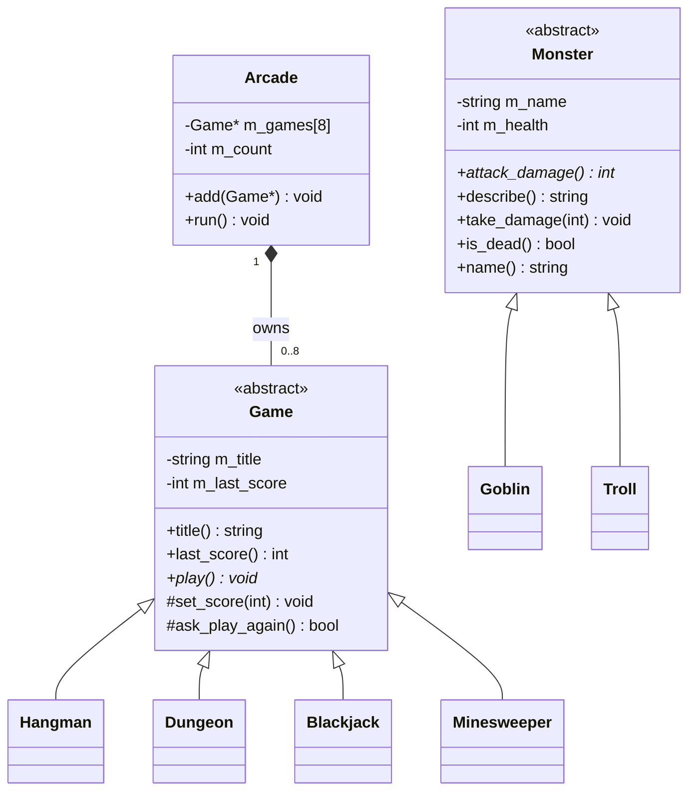

# Class diagram

```mermaid
classDiagram
    class Game {
        <<abstract>>
        -string m_title
        -int m_last_score
        +title() string
        +last_score() int
        +play()* void
        #set_score(int) void
        #ask_play_again() bool
    }

    class Hangman
    class Dungeon
    class Blackjack
    class Minesweeper

    class Arcade {
        -Game* m_games[8]
        -int m_count
        +add(Game*) void
        +run() void
    }

    class Monster {
        <<abstract>>
        -string m_name
        -int m_health
        +attack_damage()* int
        +describe() string
        +take_damage(int) void
        +is_dead() bool
        +name() string
    }

    class Goblin
    class Troll

    Game <|-- Hangman
    Game <|-- Dungeon
    Game <|-- Blackjack
    Game <|-- Minesweeper

    Monster <|-- Goblin
    Monster <|-- Troll

    Arcade "1" *-- "0..8" Game : owns
```
