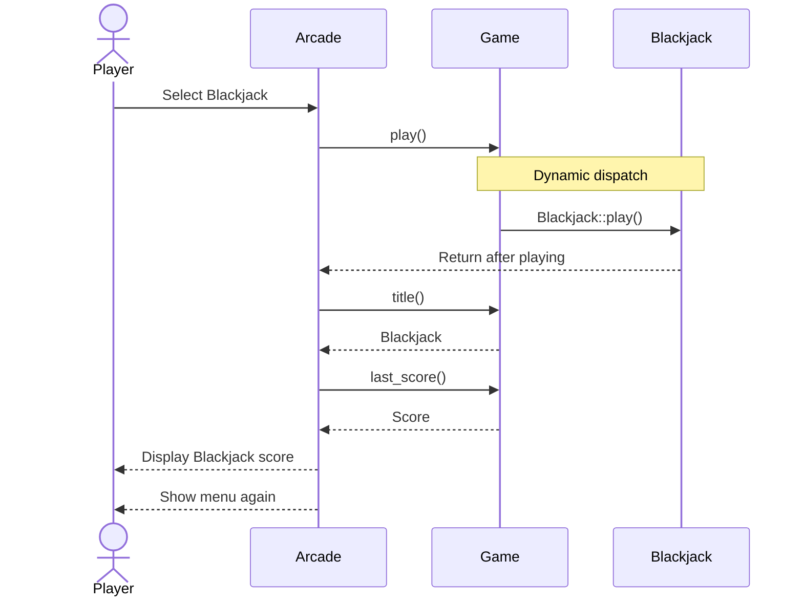

# Sequence diagram

Selecting Blackjack from the Arcade menu.

```mermaid
sequenceDiagram
    actor Player
    participant Arcade
    participant Game
    participant Blackjack

    Player->>Arcade: Select Blackjack
    Arcade->>Game: play()
    Note over Game,Blackjack: Dynamic dispatch
    Game->>Blackjack: Blackjack::play()
    Blackjack-->>Arcade: Return after playing
    Arcade->>Game: title()
    Game-->>Arcade: Blackjack
    Arcade->>Game: last_score()
    Game-->>Arcade: Score
    Arcade-->>Player: Display Blackjack score
    Arcade-->>Player: Show menu again
```
